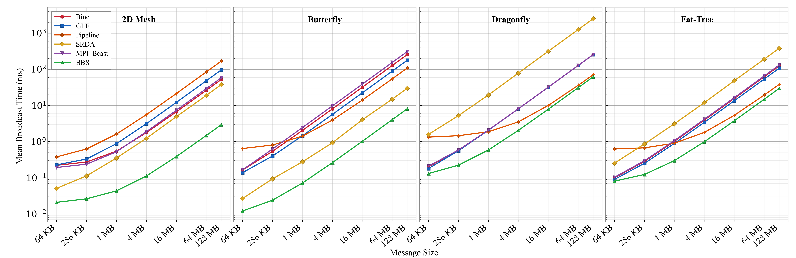

[](https://arxiv.org/abs/2510.18058)

This repository introduces **Broadcast by Balanced Saturation (BBS)** — a family of tree-based, pipelined broadcast algorithms that optimize communication efficiency across diverse network topologies. Alongside BBS, it provides baseline broadcast algorithms and a [SimGrid](https://simgrid.org/) SMPI harness for head-to-head comparison on four interconnect models (2D Mesh, Butterfly, Dragonfly, Fat-Tree) at scales from 128 to 1,024 nodes. The figure below shows experimental results at N=512.

<p align="center">
  
</p>

## Quick Start

```bash
# Build + run a single experiment (Docker auto-detected)
./run.sh bbs Dragonfly 128 65536

# Specify a single root
./run.sh bbs Dragonfly 128 65536 0

# Preview the command without running
./run.sh --dry-run mpi FatTree 256 1048576

# Run all algorithm/topology/size/message combinations
./run.sh all
```

Results are written to the project root as `<algo>_<topo>_N<N>_MSG<msg>.json`.

### Requirements

One of the following:
- **Docker** (recommended) -- image builds automatically on first run
- **Singularity** with `bcast.sif`
- **Native** SimGrid/SMPI installation (`smpicc`, `smpirun`)

## Algorithms

| Key | Algorithm | Description |
|-----|-----------|-------------|
| `mpi` | MPI_Bcast | SimGrid's built-in binomial-tree broadcast (baseline) |
| `srda` | SRDA | Scatter + Recursive-Doubling Allgather |
| `pipe` | Pipelined | Chain-pipeline: root sends chunks sequentially along a chain |
| `bine` | Binomial | Binomial tree broadcast |
| `bbs` | BBS | Bandwidth-optimal Broadcast Scheduling -- topology-aware tree construction with contention-free scheduling |
| `glf` | GLF | Greedy Link-First broadcast |

## Topologies

| Topology | Interconnect | Bandwidth | Latency | Modeled After |
|----------|-------------|-----------|---------|---------------|
| `2Dmesh` | InfiniBand NDR 400 | 50 GB/s | 100 ns | NVIDIA Eos |
| `Butterfly` | InfiniBand EDR | 12.5 GB/s | 100 ns | Kim & Dally, ISCA '07 |
| `Dragonfly` | Cray Aries | 5.25 GB/s | 100/200/400 ns | Theta (ALCF) |
| `FatTree` | InfiniBand EDR | 12.5 GB/s | 100 ns | Summit (ORNL) |

Pre-generated SimGrid platform XMLs and hostfiles for N = 128, 256, 512, 1024 are in `topo/`.

## run.sh

```
./run.sh [--dry-run] <algo> <topo> <N> <msg_bytes> [root]
./run.sh [--dry-run] all
```

| Argument | Description |
|----------|-------------|
| `algo` | Algorithm key (see table above) |
| `topo` | `Butterfly`, `Dragonfly`, `FatTree`, `2Dmesh` |
| `N` | Number of compute nodes: 128, 256, 512, 1024 |
| `msg_bytes` | Message size in bytes (e.g. 65536, 1048576) |
| `root` | Broadcast root rank (omit to sweep all roots 0..N-1) |

The script auto-detects the container runtime (Docker > Singularity > native), compiles `runner.c`, preprocesses topology data (`.tdat` files for BBS/OBFS/FFGB), and runs the experiment. Number of pipeline chunks defaults to `msg_bytes / 8192` (minimum 4).

## Runner (Direct Usage)

For direct invocation without `run.sh`:

```bash
smpirun -np <NP> -platform <xml> -hostfile <hf> \
    --cfg=smpi/host-speed:2000Gf \
    --cfg=smpi/simulate-computation:no \
    --cfg=smpi/display-timing:yes \
    --log=root.thres:warning \
    bin/runner <algo> <msg_bytes> <nchunks> <root|all|LO-HI> [out.json] [topo.tdat]
```

The `root` argument accepts:
- A single rank: `0`
- All roots: `all` (sweeps 0..N-1)
- A batch range: `0-15` (roots 0 through 15)
- With rank limit: `all:128` or `0-15:128` (for topologies where NP > N)

## Output

Single-root result:
```json
{
  "algorithm": "bbs",
  "nodes": 128,
  "msg_bytes": 65536,
  "nchunks": 8,
  "root": 0,
  "time_sec": 0.000094005,
  "correct": true
}
```

All-roots bulk result adds `mean_sec`, `stdev_sec`, `min_sec`, `max_sec`, and `per_root_sec` array.

## Project Structure

```
.
├── run.sh                  # Main entry point (compile + run)
├── Dockerfile              # Docker image (SimGrid v3.35 + numpy)
├── bcast.def               # Singularity definition
├── src/
│   ├── runner.c            # Core broadcast simulator
│   ├── Makefile
│   ├── sweep.sh            # Parallel experiment dispatch
│   ├── topo_preprocess.py  # XML -> .tdat (Floyd-Warshall, spectral analysis)
│   ├── topology_generater.py
│   ├── aggregate.py
│   └── plot_results.py
├── BBS/
│   ├── bbs.c               # BBS tree loading + execution
│   └── encode.c            # BBS tree encoding/construction
├── topo/                   # SimGrid platform XMLs + hostfiles
│   ├── 2Dmesh/
│   ├── Butterfly/
│   ├── Dragonfly/
│   └── FatTree/
├── data/                   # Experiment results (JSON)
├── encodings/              # Pre-built BBS tree encodings
├── figs/                   # Figures
└── docs/                   # Documentation + references
```

## References

- Casanova, H. et al. "Versatile, Scalable, and Accurate Simulation of Distributed Applications and Platforms." *JPDC*, 74(10), 2014.

- Degomme, A. et al. "Simulating MPI Applications: The SMPI Approach." *IEEE TPDS*, 28(8), 2017.

- Thakur, R. et al. "Optimization of Collective Communication Operations in MPICH." *IJHPCA*, 19(1), 2005.

- Kim, J. and Dally, W. "Flattened Butterfly: A Cost-Efficient Topology for High-Radix Networks." *ISCA*, 2007.
- Kim, J. et al. "Technology-Driven, Highly-Scalable Dragonfly Topology." *ISCA*, 2008.
- Leiserson, C. "Fat-Trees: Universal Networks for Hardware-Efficient Supercomputing." *IEEE ToC*, 1985.
